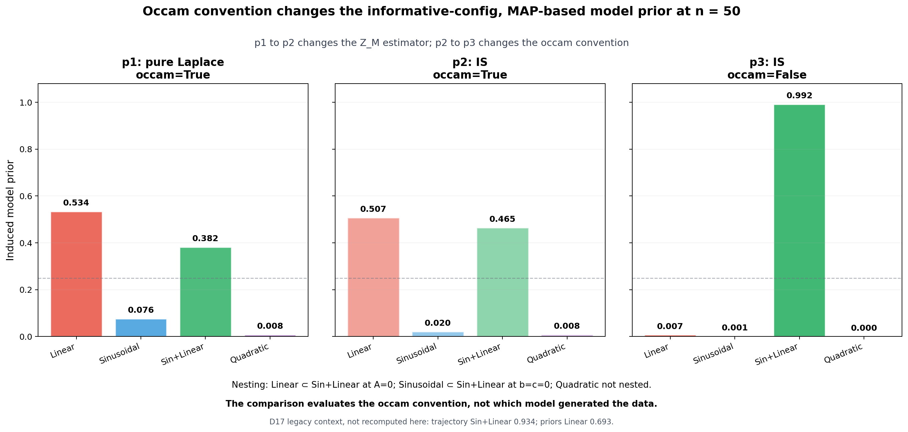

# 4. Case B: the occam flag as the Popper/Wrinch-Jeffreys dial

van Bork, Romeijn, and Wagenmakers restate Popper's objection to the
Wrinch-Jeffreys treatment of nested models: if M_r ⊂ M_e, assigning more prior
probability to the restricted model M_r violates the encompassing-model
constraint. Wrinch and Jeffreys instead permit a simplicity preference for
M_r. Their analysis motivates a direct question for the induced model prior
Z_M: which position does its reference measure encode?[^1]

The toy roster contains two relevant restrictions. Linear follows from
Sin+Linear at A=0, and Sinusoidal follows at b=c=0. Quadratic does not form a
restriction of Sin+Linear. The `occam` flag changes the measure used in Z_M:
`occam=False` integrates against raw Lebesgue measure, following the canonical
BI* convention, whereas `occam=True` divides by the reference volume
V_ref.[^2]

## 4.1 An attribution ladder, not a two-arm ablation

Figure 4 recomputes the three D17 attribution arms at n=50 and τ=0.3, with the
`informative` GP configuration and a MAP predictive. These values serve
methods validation and legacy comparison. They do not provide paper-facing
posterior inference about which model generated the data.[^3]

**Figure 4.** Induced model priors for the nested toy roster. The p1 and p3
panels differ in both the Z_M estimator and the `occam` convention, so the p2
panel prevents a conflated attribution. Replacing pure Laplace with IS while
retaining `occam=True` changes the Linear and Sin+Linear probabilities from
0.534 and 0.382 in p1 to 0.507 and 0.465 in p2. Changing only the convention
in the next step gives 0.007 and 0.992 in p3. At p2, ESS implies SE(log Z) of
approximately 0.008, 0.017, and 0.038 nats for Linear, Sin+Linear, and
Sinusoidal, respectively, with probability SE approximately 0.005. The estimator
change narrows the gap; removing the V_ref normalization decides the verdict.
The dial figure argues about the `occam` convention's effect, not about which
model generated the data.

The figure's τ=0.3 evaluation point falls 1.6 percent above the `occam=True`
Linear/Sin+Linear crossing at τ≈0.295. The p2 log Z_M gap of 0.0867 nats gives
a Bayes factor of about 1.09, so the `occam=True` panels report an essentially
tied comparison. The p1/p2 "Linear preferred" reading therefore remains
τ-marginal, while the p2-to-p3 magnitude change provides the robust content.

The earlier contradiction supplies useful historical context but not new
evidence. D17 records 0.934 for Sin+Linear in the legacy trajectory script and
0.693 for Linear in the legacy priors script, which hard-coded
`occam=True`. The pinned-commit extraction in
`viz_unification_compare.py` regenerates those legacy arms. The new figure
does not invoke or parse that extraction.[^2]

## 4.2 E6: best achievable divergence under exact nesting

As τ approaches zero, the leading contribution to Z_M comes from
min_φ Ḡ(φ). The reachable-set argument therefore requires

\[
\min_{\phi}\bar G(M_e) \leq \min_{\phi}\bar G(M_r).
\]

Different parameter dimensions prevent a Lebesgue-monotonicity argument in
parameter space. Given the two exact embeddings and the mean-only divergence,
however, the inequality follows analytically from reachable-set containment in
data space. The visualization box uses A ≥ 0.01 as a numerical cutoff, so E6
alone extends the encompassing amplitude bound to A ≥ 0. All other bounds
match the visualization arms. The restricted optima seed the encompassing
multi-start optimization, and the package divergence calculation reproduces
each restricted value at its embedding within the declared 10^-10 tolerance.
E6 thereby confirms that the implementation reproduces the analytic
consequence, providing a machinery check rather than empirical support for the
containment claim.[^4]

For this n=50, `informative`-configuration, MAP-based averaged GP, the machinery
check obtains min_φ Ḡ=0.046 for Sin+Linear, 2.425 for Linear, and 2.546 for
Sinusoidal. It quantifies restricted-minus-encompassing margins of 2.379 and
2.501 nats, respectively, far above the 10^-8 comparison tolerance. The
empirical content of E6 consists of these margins and the finite-τ Z_M
crossings.[^4]

Finite τ separates the two reference measures. One IS call per model per seed
evaluates 161 temperatures for seeds 0, 1, and 2. With `occam=False`,
Sin+Linear retains the larger pairwise Z_M throughout the grid for all three
seeds, so neither nested pair crosses. With `occam=True`, the Linear crossing
occurs at τ=0.295, 0.295, and 0.296 across seeds 0, 1, and 2. Seed 0 has grid
bracket [0.282, 0.299], the per-seed spread is [0.295, 0.296], and its
ESS-implied one-SE shift interval is [0.295, 0.296]. The seed-0 bracket delta
swing of 0.354 nats exceeds the ESS-implied SE of approximately 0.012 nats, so
the three-decimal Linear crossing is sign-supported. The Sinusoidal crossing
occurs at 1.484, 1.584, and 1.382 across those seeds; it should be summarized
only as τ ≈ 1.5. Its seed-0 bracket is [1.413, 1.496], the per-seed spread is
[1.382, 1.584], and the seed-0 ESS shift roots are [1.392, 1.563]. The enclosing
grid-and-seed uncertainty interval is about τ 1.33 to 1.59.
Crossing resolution is set by the larger of grid spacing and Monte Carlo error.
Thus low temperature supports Popper's encompassing constraint in both
conventions for this example, while V_ref normalization permits the
finite-temperature simplicity preference associated with Wrinch and
Jeffreys.[^4]

The two controls should therefore remain explicit. Temperature governs how
strongly best achievable divergence dominates integrated compatibility, while
`occam` selects raw or volume-normalized reference measure. Their joint
sensitivity describes the Popper/Wrinch-Jeffreys disagreement without turning
a methods-validation example into a claim about model truth.

[^1]: 🟢 peer-reviewed — van Bork, Romeijn, and Wagenmakers (2025), *Synthese*, doi:10.1007/s11229-025-05286-y.
[^2]: 🟠 empirical — `Notes/DECISIONS.md` D3, D5, and D17; legacy regeneration through `bistar_viz/scripts/viz_unification_compare.py` at pinned commit `a87356a`.
[^3]: 🟠 empirical — `experiments/occam_dial_figure.py`; `runs/occam_dial/figure_results.json`.
[^4]: 🟠 empirical — `experiments/e6_nesting_monotonicity.py`; `runs/occam_dial/e6_results.json`.

---
*Provenance: `runs/occam_dial/` · `experiments/occam_dial_figure.py` ·
`experiments/e6_nesting_monotonicity.py` · `Notes/DECISIONS.md` D17, D62.*
