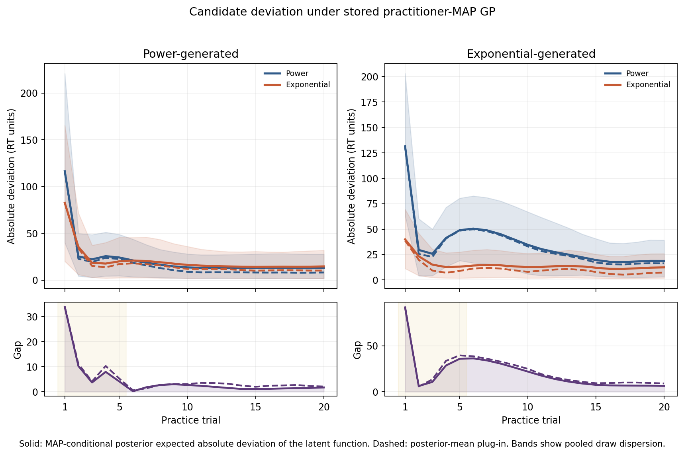

# 6. Case D: M-open calibration through a warranted decline [DRAFT]

## Calibration before an M-open claim

A relative winner does not establish adequacy. BMS* retains the raw
divergences (G(\psi,\theta)), so it can ask whether even the closest candidate
remains far from the GP patterns. That absolute reading needs a reference
distribution under known truth. Without one, a large-looking value has no
calibrated interpretation. Formal M-open calibration therefore remains an open
problem.

The practice-law artifacts offer a bounded first step, not an M-open test. Their
data directory contains no Evans et al. observations. `run.py` instead generated
50 synthetic series with seed 42, divided equally between power and exponential
truth. Each subject's generating form appears among the two fitted candidates.
The source artifacts record between 20 and 79 observations per subject, and the
stored practice (G) values were computed on 50 uniformly spaced points spanning
each subject's full series. The reconstructed deviation curves instead cover
integer trials 1 through 20. For the longest subjects, that early grid spans
19/78, or 24.4%, of the full continuous trial range. Any linkage between those
curves and the stored aggregate comparisons therefore applies only to their
shared early-trial region. We use these data to study distinguishability and
mimicry and to establish correct-specification reference levels for (G); we do
not infer how either candidate fits the real Evans corpus.[^case-d-empirical]
Evans et al.'s broader candidate discussion motivates the context, while every
result below concerns only Power and Exponential, the pair retained in the
stored fits.[^case-d-evans]

## Two failure geometries

Two obstacles require separate diagnoses. F1 concerns scaffold
representability. A stationary RBF kernel assigns one global lengthscale, while
power and exponential curves differ through a location-dependent rate of
curvature change. The scaffold can smooth over the local feature needed for
discrimination. F2 concerns intrinsic mimicry. Across some parameter regions,
the candidate families generate nearly indistinguishable patterns, so changing
the scoring rule cannot create information absent from the data.

Navarro, Pitt, and Myung's landscaping method maps such variation in
distinguishability over retention-model parameter spaces. Their analysis shows
why a close fit at one observed data set cannot establish that the models were
distinguishable there: one candidate may mimic another over a broad region.[^case-d-navarro]
Their empirical setting concerned retention rather than practice, so the link
here concerns failure geometry, not a replication. Under that geometry, weak
separation can reflect a warranted decline rather than a failed demand for a
winner. The synthetic known-truth design sharpens the interpretation: when the
correct family appears in the roster yet remains hard to recover, F1, F2, or
both have constrained the comparison.

## What the stored comparisons declined

We prefer `results_hmc/` over the MAP-mode directory because it contains the
HMC-mode practice run requested for this case. Its aggregate baseline assigns
18 subjects to Power and 32 to Exponential under BIC, although the generator
split equals 25 and 25; 41 of 50 labels match known truth. The BMS* winner labels
at the stored median temperature, τ = 1.778, vary substantially with the legacy
pointwise metric:

| GP configuration | `pw_hellinger`, Power / Exponential | `pw_mse`, Power / Exponential | `pw_nll`, Power / Exponential |
|---|---:|---:|---:|
| practitioner | 22 / 28 | 6 / 44 | 10 / 40 |
| moderate | 32 / 18 | 7 / 43 | 12 / 38 |
| agnostic | 27 / 23 | 7 / 43 | 12 / 38 |

Across the 50 subjects, all three configurations select the same winner for 39
subjects under `pw_hellinger`, 49 under `pw_mse`, and 48 under `pw_nll`.

These practice artifacts predate W1. They contain `pw_nll`, `pw_mse`, and
`pw_hellinger`, not the manuscript's primary `pw_kl_vcal`; no new metric was
authorized for Case D, and we do not relabel the stored quantities.
Legacy `pw_nll` weights squared error by the candidate's fitted noise variance,
whereas `pw_kl_vcal` weights it by the GP variance. On that weighting axis,
`pw_mse` lies closer to the manuscript primary.

For all 300 stored configuration-by-subject-by-candidate `mean_G` pairs,
`pw_nll = 0.5 log(2 pi sigma_theta^2) + pw_mse/(2 sigma_theta^2)` to maximum
absolute error $1.78 \times 10^{-15}$. Thus `pw_nll` and `pw_mse` apply a
candidate-specific affine map to the same squared-error statistic; the divisor
`2 sigma_theta^2` ranges from 743 to 7,161, approximately 750 to 7,150. BMS*
scores `exp(-G/tau)` at a shared $\tau$, so soft-transfer probability magnitudes
are not comparable across metrics on different scales. No value on the stored
15-point grid removes the gap: the power-cohort `pw_nll` medians peak around
0.57 (approximately 0.573 in the review summary) at $\tau=0.1$, while the
all-subject practitioner `pw_mse` median remains 0.987 at $\tau=31.6$.[^case-d-empirical]

The tau-free, scale-invariant `pw_nll` `raw_draw_wins` diagnostic carries the
asymmetry instead:

| GP configuration | Power truth: true-family draw wins / subject majorities | Exponential truth: true-family draw wins / subject majorities |
|---|---:|---:|
| practitioner | 39.0% / 9 of 25 | 98.7% / 25 of 25 |
| moderate | 39.9% / 8 of 25 | 94.6% / 25 of 25 |
| agnostic | 41.5% / 9 of 25 | 92.1% / 25 of 25 |

These `pw_nll` counts describe how often the known-truth candidate attains the
smaller raw divergence on the 100 stored GP draws per subject. They support a
metric-specific asymmetric-recovery statement without interpreting a
temperature-dependent probability magnitude.[^case-d-empirical]

## Absolute divergence magnitudes

Rankings discard the common level of mismatch. The stored `pw_nll`
diagnostics retain the mean (G) over 100 GP draws for each fitted candidate.
The cohort means below come directly from those stored values; the Case D
script aggregates them without recomputing (G).

| GP configuration | Power truth: (G_{\mathrm{Power}}) | Power truth: (G_{\mathrm{Exp}}) | Exponential truth: (G_{\mathrm{Power}}) | Exponential truth: (G_{\mathrm{Exp}}) |
|---|---:|---:|---:|---:|
| practitioner | 4.799 | 4.775 | 5.003 | 4.582 |
| moderate | 4.858 | 4.830 | 5.045 | 4.688 |
| agnostic | 4.834 | 4.811 | 5.045 | 4.715 |

Within these `pw_nll` summaries, the power-generated rows exhibit the mimicry
signature: both magnitudes nearly coincide, and the wrong exponential candidate
has the slightly smaller cohort mean. The `pw_nll` exponential-generated rows
separate more clearly and favor the known truth. At synthetic exponential
subject 25, the practitioner `pw_nll` means
equal 4.881 for Power and 4.852 for Exponential, an absolute difference of
0.029. A ranking reports only Exponential; the paired magnitudes show how
little separates the candidates for that subject.[^case-d-empirical]

The `pw_nll` table also blocks an overstatement about M-open inadequacy.
Correctly specified candidates can produce `pw_nll` mean (G) values from 4.582
to 4.858 in these cohort summaries, while a wrong but mimicking candidate can
occupy much of the same scale. A future inadequacy rule must compare an observed
magnitude with a
reference distribution under correct specification, conditional on metric,
configuration, sample size, and noise. These known-truth `mean_G` distributions
supply the kind of calibration material such a rule needs, but Case D does not
set a rejection threshold.

## MAP-conditional deviation localizes the comparison

The subject JSONs omit GP curves and draws. The new reconstruction regenerates
the synthetic observations, verifies each stored candidate fit through its BIC
residual structure, rebuilds an exact GP at the stored hyperparameters, and
computes its latent posterior mean plus 100 seeded latent posterior functions
per subject. No refitting and no new HMC occur.

One provenance and estimand limitation matters. `run.py` writes one
`gp_hyperparameters` block immediately after the first successful configuration
MAP fit. With the default order, all 50 source files record the practitioner MAP
point even though `results_hmc/` subsequently uses HMC samples for its stored
BMS* diagnostics. The JSONs do not retain those HMC hyperparameter draws, so
neither reconstruction below averages posterior mean functions over
hyperparameter draws as in the limits-note formula. The solid curves instead
report the MAP-conditional posterior expected absolute deviation of the latent
function,

\[
R^{\mathrm{draw}}_{\theta}(t)
= \mathbb{E}_{f\mid y,\hat{\eta}}
  \left[\left|f(t)-\mu_{\theta}(t)\right|\right],
\]

and the dashed curves report the mean-based plug-in at the same MAP point,

\[
R^{\mathrm{mean}}_{\theta}(t)
= \left|\mathbb{E}\!\left[f(t)\mid y,\hat{\eta}\right]
  -\mu_{\theta}(t)\right|.
\]

Jensen's inequality makes $R^{\mathrm{draw}}_{\theta}(t)$ no smaller than
$R^{\mathrm{mean}}_{\theta}(t)$ for each subject, candidate, and trial. Latent
posterior spread therefore inflates candidate deviations and generally
compresses their gap by a trial-dependent amount, so the two estimands should
not be substituted silently.

Each solid line pools 25 subjects and 100 draws within a truth cohort. Its band
spans the pooled 10th and 90th percentiles of the resulting 2,500 absolute
errors at each trial; it describes subject-and-draw dispersion, not uncertainty
in the cohort mean. Each dashed line averages the 25 subject-level plug-in
deviations; corresponding subject quantiles remain in `results.json`.

| Estimand | Truth cohort | Mean Power deviation (RT units) | Mean Exponential deviation (RT units) | Peak gap (RT units) | Gap in trials 1–5 | Gap in trials 1–10 |
|---|---|---:|---:|---:|---:|---:|
| MAP-conditional posterior expected absolute deviation | Power | 21.383 | 20.681 | 33.782 at trial 1 | 70.0% | 82.2% |
| Posterior-mean plug-in | Power | 17.638 | 17.325 | 34.052 at trial 1 | 63.3% | 74.0% |
| MAP-conditional posterior expected absolute deviation | Exponential | 35.587 | 14.855 | 91.452 at trial 1 | 41.7% | 77.7% |
| Posterior-mean plug-in | Exponential | 33.901 | 10.764 | 92.890 at trial 1 | 40.0% | 75.0% |

Both profiles concentrate toward the beginning but do not collapse to only the
first few trials. For the MAP-conditional posterior expected absolute deviation
under power truth, trial 1 produces 116.333 RT units for Power and 82.551 for
Exponential, with the wrong family closer where the largest gap occurs. Under
exponential truth, the corresponding values equal 131.415 and 39.963, and
appreciable separation continues through the first half of the grid. The two
estimands therefore show a consistent descriptive localization under the
stored practitioner-MAP scaffold. Within the shared early-trial region, that
localization agrees with the asymmetric practitioner `pw_nll` raw-draw result;
it cannot explain the portion of the stored aggregate comparison evaluated
later in each subject's full series.[^case-d-empirical]

The branch contains exactly one practitioner-MAP RBF reconstruction, and all
three stored configurations use the RBF family. These artifacts cannot identify
whether the localized `pw_nll` recovery asymmetry originates in F1
representability, F2 mimicry, metric behavior, or sampling noise. That
non-identifiability matches the F1/F2-agnostic interpretation above.

## Positioning and optional extension

Averell and Heathcote showed that power-versus-exponential conclusions about
forgetting can change between individual-level and population-level analyses.
Their result warns against treating one comparison procedure or aggregation
level as a resolution of the functional-form debate.[^case-d-averell] Case D
supports a narrower conclusion. On synthetic practice curves, the legacy
`pw_nll` raw-draw results show asymmetric recovery, its raw divergence
magnitudes provide correct-specification reference levels, and both
MAP-conditional deviation estimands descriptively localize part of that
asymmetry in the shared early-trial region. Nothing here identifies its cause or
adjudicates the real practice data or the forgetting literature.

> **[E8B-PLACEHOLDER] UNBUILT OPTIONAL MODULE.** The proposed extension would
> refit in semi-log and log-log spaces, with an explicit lognormal or
> heteroskedastic noise correction, to turn curvature-rate differences into a
> global linearity comparison; a Murre and Dros real-data companion would
> remain separate from the present synthetic cohort. The driver deferred
> `e8b_transform_space.py` in this pass. The author may commission the module or
> excise this entire block; the current evidence makes no transform-space
> claim.

[^case-d-navarro]: 🟢 peer-reviewed — Navarro, D. J., Pitt, M. A., & Myung, I. J. (2004). Assessing the distinguishability of models and the informativeness of data. *Cognitive Psychology, 49*(1), 47–84. https://doi.org/10.1016/j.cogpsych.2003.11.001
[^case-d-evans]: 🟢 peer-reviewed — Evans, N. J., Brown, S. D., Mewhort, D. J. K., & Heathcote, A. (2018). Refining the law of practice. *Psychological Review, 125*(4), 592–605.
[^case-d-averell]: 🟢 peer-reviewed — Averell, L., & Heathcote, A. (2011). The form of the forgetting curve and the fate of memories. *Journal of Mathematical Psychology, 55*(1), 25–35.
[^case-d-empirical]: 🟠 empirical — `experiments/regret_curves_mopen.py`; `runs/regret_curves_mopen/results.json` and `regret_curves.png`. The script reads `experiments/practice_EvansEtAL/results_hmc/aggregate.json` and its 50 subject JSONs, asserts reconstruction fidelity, and records all reported practice-run numbers in one artifact.

---
*Provenance: `runs/regret_curves_mopen/` · `experiments/regret_curves_mopen.py` · D64.*
