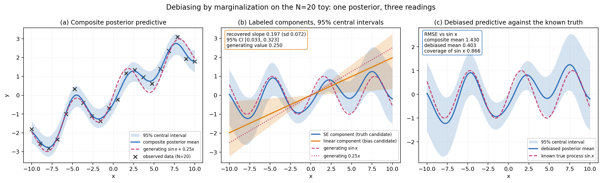

# 7. From evaluation to debiasing

The accepted proposal and thesis chapter 5 set two goals for this program:
evaluating candidate models through data priors, and mitigating bias. Sections
1 through 6 and 8 develop the first. The second follows from the same
construction rather than from new machinery. Candidates are graded against the
posterior over data patterns ψ, and that posterior supports more than grading.
Under an additive kernel the function underlying each ψ decomposes into
components, each component admits a substantive label, and labeling one
component as bias turns its removal into marginalization. Evaluation and
mitigation therefore draw on one object.[^1]

## 7.1 The demonstration

The data come from `generate_toy_data()` at its defaults: N=20 points on
[-10, 10], seed 42, observation noise 0.5, and y = sin(x) + 0.25x + noise. The
generator itself names the linear term the bias, so the demonstration inherits
a known true process and a known bias process instead of asserting either.[^2]

The GP uses the SE plus linear additive kernel under the `toy_elicited`
data-elicited prior, the configuration validated for this N=20 instance.
Hyperparameters come from the corrected NUTS path in two seeded chains,
20260813 and 20260814, with 500 warmup and 500 retained draws each, target
acceptance 0.8 and maximum tree depth 8. Both chains initialize at the same MAP
point, so the rank-normalized R-hat reported here measures mixing within the
mode the optimizer selected and not agreement between dispersed starts; the toy
hyperparameter posterior is multi-basin, which makes the distinction worth
stating explicitly. Across the four hyperparameters the run gives no
divergences, rank-normalized R-hat at most 1.0025, bulk ESS at least 602.4, and
tail ESS at least 502.6.[^2]

Every one of the 1,000 retained draws is decomposed by the package
additive-kernel machinery into an SE component, treated as the truth candidate,
and a linear component, treated as the bias candidate; all 1,000 decompositions
succeed.[^3] The debiased predictive of the true process consists of the
SE-component posterior with the linear component marginalized out. That
marginalization happens analytically within a draw, because the component
posterior the decomposition returns already forms the marginal of the joint
conditional Gaussian, and by Monte Carlo across draws for the hyperparameters.
Reported intervals are exact central intervals of the resulting draw mixture
rather than Gaussian approximations to it, and all bands are latent-function
bands with no observation noise added.[^2]

**Figure 7.** Three readings of one posterior on the N=20 toy. Panel (a) shows
the composite posterior predictive against the observed data, which the
composite describes well. Panel (b) shows the two labeled components with their
95 percent central intervals against the generating sin(x) and 0.25x curves.
Panel (c) shows the debiased predictive against the known true process. The
annotated slope and RMSE readouts are computed from the artifact values.

Turning to recovery, the bias-slope posterior has mean 0.197 with standard
deviation 0.072 and a 95 percent central interval of [0.033, 0.323], which
contains the generating value 0.250. On a grid of 201 equally spaced points
inside the training span, the composite posterior mean differs from sin(x) by
an RMSE of 1.430 and the debiased posterior mean by 0.403, a reduction of 1.028
or 71.9 percent. Between-chain scatter in those two quantities is small: 1.431
and 1.430 for the composite arm, 0.403 and 0.402 for the debiased arm.[^2]

The composite value of 1.430 has a plain reading that should be stated rather
than left to the reader. On the same grid the drift 0.25x has RMS 1.451, so the
composite arm's discrepancy with sin(x) essentially reproduces the displacement
it was fitted to include. The debias claim concerns how much of that known
displacement marginalization removes, and it removes most of it. What remains,
0.403, is not negligible against the true process's own RMS of 0.690.[^2]

The debiased band covers sin(x) at 174 of the 201 grid points, 0.866 against a
nominal 0.95. Neighboring grid points share nearly the same posterior, so the
figure summarizes pointwise coverage rather than testing calibration over
independent trials; read that way it records mild undercoverage and not a
validated interval procedure.[^2]

## 7.2 What the demonstration does and does not establish

Two limits deserve statement.

First, identifying the linear component as bias is a modeling choice rather
than an inference. Construction licenses the choice here, because the generator
produced the drift. No generator supplies that warrant in an application, and
the analyst must justify the kernel labeling on substantive grounds before a
marginalization result means what its name suggests. The decomposition
machinery will split an additive posterior whichever way the labels are
assigned, and the split acquires interpretation only from the labeling
argument.

Second, the data determine the split far less sharply than they determine the
fit. The debiased band has mean width 1.836 on the grid while the composite
band has mean width 1.032, so the observations constrain the sum of the two
components more tightly than they constrain either component alone. That
difference gives concrete form to the expectation recorded in section 8.5: when
the grounds for treating one component as bias come from outside the observed
data, additional observations sharpen the composite while leaving the
attribution comparatively uncertain, and honest inference retains an
uncertainty floor that sample size does not remove.[^2]

The full development belongs to the companion line. The program originates in
thesis chapter 5, and the real-data study proceeds under its own
preregistration; no real-data result is reported or forecast here.[^1]

[^1]: 🟡 thesis — Chandramouli (2020), doctoral dissertation, Indiana University; Chapter 5 instantiates BI* with Gaussian Processes and states the debiasing program. 🟣 framework — Chandramouli and Shiffrin (2016), "Extending Bayesian induction," *Journal of Mathematical Psychology*, 72, 38–42.
[^2]: 🟠 empirical — `experiments/toy_debias_demo.py`; `runs/toy_debias_demo/results.json` and `README.md` (data seed 42; MAP-init torch seed 42; NUTS chain seeds 20260813 and 20260814).
[^3]: 🟠 empirical — decomposition through `bistar_gp.decompose.decompose_additive_gp`, the package implementation of the thesis Eq. 5 additive-kernel decomposition, with the joint posterior from `decompose_component` on the summed kernel blocks so the inter-component cross-covariance is retained; success counts and the linear-component structure checks in `runs/toy_debias_demo/results.json`.

---
*Provenance: `runs/toy_debias_demo/` · `experiments/toy_debias_demo.py` ·
`Notes/DECISIONS.md` D67.*
